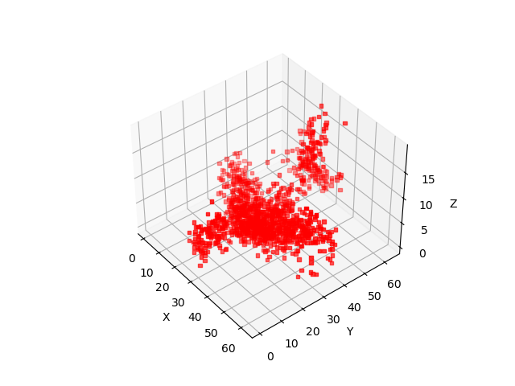

# 3D GAN

Advance Computer Vision Project

Contributors:
 - Vishal Kumar Yadav | B20EE080
 - Mohit Mathuria | B20BB022

This is an implementation of the paper: [Learning a Probabilistic Latent Space of Object Shapes via 3D Generative-Adversarial Modeling](https://arxiv.org/abs/1610.07584)

Dataset: [ModelNet40](https://www.kaggle.com/datasets/balraj98/modelnet40-princeton-3d-object-dataset)

## Requirements

- torch
- matplotlib
- numpy
- tqdm
- pandas
- scikit-learn

## Usage

### Training

```bash
python train.py --metadata [Path to the metadata] --savepath [Path to save models] --object_to_train_for [class of the shape] --batch_size [batch size]
```

### Testing
The below script will download the pre trained generator model, use a random noise vector to generate a shape and show the result.

```bash
sh test.sh
```

# Results




## References

- [Learning a Probabilistic Latent Space of Object Shapes via 3D Generative-Adversarial Modeling](https://arxiv.org/abs/1610.07584)

- [ModelNet40](https://www.kaggle.com/balraj98/modelnet40-princeton-3d-object-dataset)

